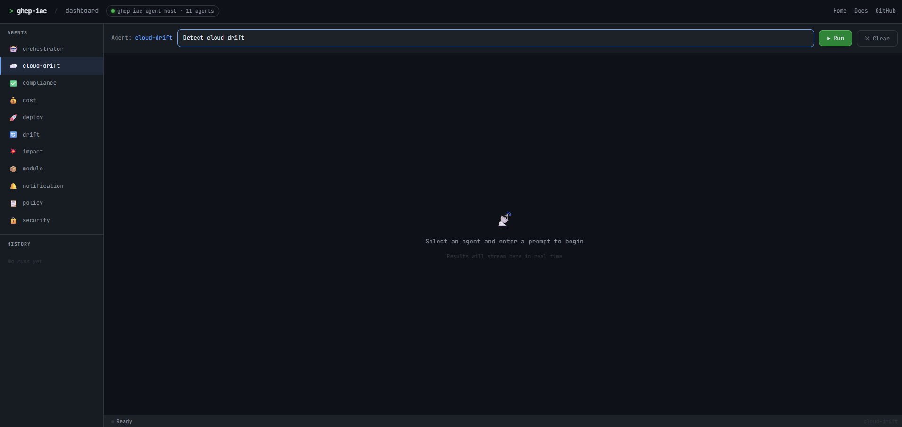
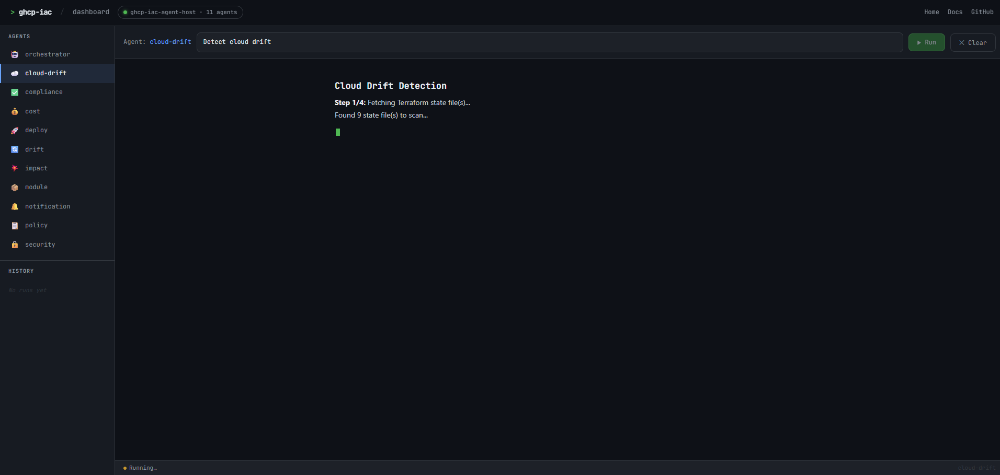
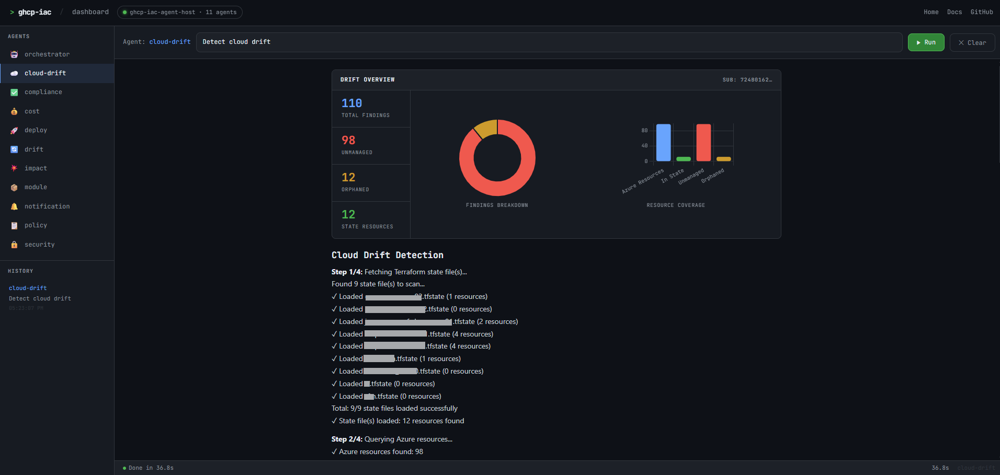
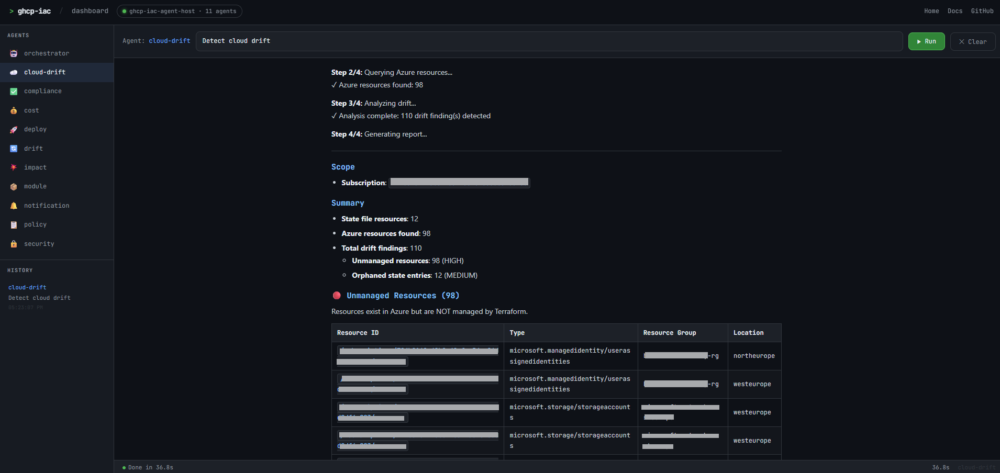
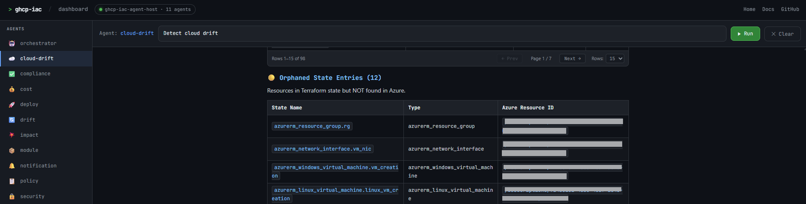

# Cloud Drift Detection Agent

Detects infrastructure drift by comparing Terraform state (stored in Azure Blob) with live Azure resources discovered via CloudQuery.

---

## 1. Switch to the feature branch

```bash
git checkout creation-ofdashboard-for-cloud-drift-agent
```

---

## 2. Configure the environment

Create (or update) the `.env` file in the **project root**:

```env
# Azure Auth — Service Principal with Reader role on the target subscription
AZURE_SUBSCRIPTION_ID=<your-subscription-id>
AZURE_CLIENT_ID=<your-client-id>
AZURE_CLIENT_SECRET=<your-client-secret>
AZURE_TENANT_ID=<your-tenant-id>

# State Backend — Azure Blob Storage that holds your Terraform state
TF_STATE_BACKEND_TYPE=azureblob
TF_STATE_BACKEND_CONNECTION=https://<your-storage-account>.blob.core.windows.net/
TF_STATE_CONTAINER=<your-container-name>
TF_STATE_SCAN_ALL=true

# Drift scope — comma-separated: unmanaged, orphaned, config
DRIFT_TYPES=unmanaged,orphaned,config
```

| Variable | Description |
|---|---|
| `AZURE_SUBSCRIPTION_ID` | Azure subscription to scan |
| `AZURE_CLIENT_ID` | Service Principal app (client) ID |
| `AZURE_CLIENT_SECRET` | Service Principal secret |
| `AZURE_TENANT_ID` | Azure AD tenant ID |
| `TF_STATE_BACKEND_TYPE` | Backend type — `azureblob` or `local` |
| `TF_STATE_BACKEND_CONNECTION` | Blob storage endpoint URL |
| `TF_STATE_CONTAINER` | Container name holding `.tfstate` files |
| `TF_STATE_SCAN_ALL` | `true` to scan all state files in the container |
| `DRIFT_TYPES` | Which drift categories to detect |

> **Tip:** The `run-app.ps1` script reads `.env` automatically — you do not need to set environment variables manually.

---

## 3. Build and run the app

From the **project root**, run:

> **First time?** Build the binary first:
> ```powershell
> go build -o agent-host.exe ./cmd/agent-host
> ```

```powershell
.\run-app.ps1
```

The script:
1. Reads every `KEY=VALUE` line from `.env` and sets it as a process-level environment variable.
2. Launches `agent-host.exe` (compiled Go binary).

Expected output:

```
agent-host listening on :8080 (version=... commit=...)
```

---

## 4. Open the dashboard

Navigate to:

```
http://localhost:8080/dashboard
```

The dashboard will:
- Show all registered agents in the left sidebar — select **cloud-drift**.
- Pre-fill the default prompt.
- Stream the drift report as Markdown in real time.
- Render a **donut chart** (findings breakdown) and a **bar chart** (resource coverage) automatically once the report completes.
- Paginate the Unmanaged and Orphaned resource tables (15 rows per page by default).

---

## 5. API endpoint (optional)

You can also call the agent directly:

```powershell
# SSE stream (default)
Invoke-RestMethod -Uri "http://localhost:8080/agent/cloud-drift" `
  -Method POST `
  -ContentType "application/json" `
  -Body '{"messages":[{"role":"user","content":"Run drift detection"}]}'

# Plain-text response
Invoke-RestMethod -Uri "http://localhost:8080/agent/cloud-drift?format=plain" `
  -Method POST `
  -ContentType "application/json" `
  -Body '{"messages":[{"role":"user","content":"Run drift detection"}]}'
```

| Endpoint | Method | Description |
|---|---|---|
| `GET /health` | GET | Server health + agent count |
| `GET /agents` | GET | List all registered agents |
| `POST /agent/cloud-drift` | POST | Run cloud drift detection (SSE stream) |
| `POST /agent/cloud-drift?format=plain` | POST | Run cloud drift detection (plain text) |
| `GET /dashboard` | GET | Open the browser dashboard |

---

## 6. Understanding the output

The drift report sections:

| Section | Severity | Meaning |
|---|---|---|
| **Unmanaged resources** | 🔴 HIGH | Azure resources that exist but are not tracked in any state file |
| **Orphaned state entries** | 🟡 MEDIUM | Resources referenced in state but no longer found in Azure |
| **Configuration drift** | 🟠 MEDIUM | Resources tracked in state whose live config differs from desired state |

Charts appear automatically in the dashboard when drift data is detected:
- **Donut** — proportional breakdown of finding types
- **Bar** — total Azure resources vs. state-managed vs. unmanaged vs. orphaned

---

## 7. Screenshots

### Dashboard — Agent selection & prompt


### Live streaming output


### Summary charts (donut + bar)


### Unmanaged resources table (paginated)


### Orphaned state entries table (paginated)


